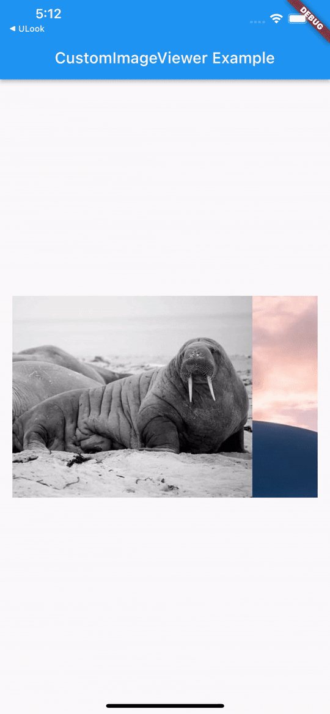

# CustomImageViewer

This package allows you to view images of multiple types


```dart
return PageView.builder(
  itemCount: imageList.length,
  scrollDirection: Axis.horizontal,
  itemBuilder: (context, index) {
    var image = imageList[index];
    return CustomImageViewer(
      initialIndex: index,
      images: imageList,
      child: Image.network(image),
    );
  },
);
```

This pack is designed for my personal needs, feel free to customize it for yourself.

